## 📝🎨🚀 30diasDeCSS 🚀🎨📝

 30 dias de CSS3, é um desafio para ajudá-lo a melhorar suas habilidades de codificação fazendo mini projetos de animações diariamente, utilizando HTML e CSS (no momento que estou realizando esse projeto também estou aprendendo sobre o SASS que é um pré-processador CSS, então também decidi adicioná-lo ao desafio)

 Créditos a idealizadora do desafio 30 dias de CSS [@MilenaCarecho](https://github.com/MilenaCarecho) ⭐
 Repositório original do desafio: [30diasDeCSS](https://github.com/MilenaCarecho/30diasDeCSS) ⭐

 ## 🎯 Objetivo

 30 dias de CSS é um desafio que vou aceitar (e você também pode participar) a partir de 23 de julho de 2022, que visa melhorar minhas habilidades em HTML5, CSS3 e SASS através da realização de projetos durante 30 dias

***Se você chegou agora e quer começar o desafio, fique a vontade, o desafio não tem data de início fixa, cada um faz os seus 30 dias e pode personalizar com suas próprias regras, eu ficarei contente com sua participação 😉***

## Para participar:

* Acesse o link e siga as instruções: https://github.com/MilenaCarecho/30diasDeCSS/issues/1

## 🧾 Regras gerais

* Realizar um projeto por dia
* Compartilhe seu progresso nas mídias sociais (Twitter, Facebook, Linkedin etc.) usando a hashtag #30diasDeCSS
* O projeto deve ser concluído até 23:59 de cada dia

### Regras pra mim

* Eu criei algumas regras para mim que não quero impor a ninguém, mas fique à vontade para fazer o mesmo, se quiser!
* Se eu não concluir o projeto do dia, no próximo dia eu devo entregar o projeto atrasado, o do dia atual e mais um de bônus.
* No final do desafio ter um site com todos os projetos
* Fazer um post falando sobre os 30 dias

## 🛠️ Tecnologias utilizadas no processo
*   

#### Referências que usei para aprender 📚

[W3schools](https://www.w3schools.com) -
[MDN Web Docs](https://developer.mozilla.org/pt-BR) -
[Online Tutorials](https://www.youtube.com/channel/UCbwXnUipZsLfUckBPsC7Jog) -
[Creative Creations](https://www.youtube.com/channel/UCOKmVksbzoKJKmtu7rlEM1A) -
[DarkCode](https://www.youtube.com/channel/UCD3KVjbb7aq2OiOffuungzw) -
[SASS](https://sass-lang.com/)

### Principais tópicos que aprendi durante o processo

- Variáveis SASS (Muito usadas para armazenar informações e reutilizar)
- Módulo `@use` (Para carregar e combinar múltiplas folhas de estilo)
- Arquivos SASS parciais (São arquivos que devem ser importados mas não compilados)
- Aninhamento de seletores e propriedades CSS (São úteis para combinar seletores e propriedades CSS)
- `@extend` (Permite estender um conjunto de propriedades CSS de um seletor para outro)
- Uso do loop `@for` (Útil quando combinado com pseudo-seletores `:nth-*` do CSS)
- `@mixins` (Os mixins são parecido com a funcionalidade "@extend", porém os mixins funcionam e tem sua sintaxe semelhante com funções em JavaScript e aceitam parâmetros para tornar seu código mais flexível)
- Loop `@each` (faz um loop sobre cada item em uma lista(semelhante a um array em JavaScript) ou mapa(semelhante a um objeto em JavaScript))

### Índice dos desafios: 📋

* [Dia 01 - Ícones de mídias sociais em camada](#id01) ✔️
* [Dia 02 - Loaders animados](#id02) ✔️
* [Dia 03 - Letreiro com mudança de cor de texto](#id03) ✔️
* [Dia 04 - Botões com efeito de borda, hover e click](#id04) ✔️
* [Dia 05 - Joias do infinito com efeito de pulsar](#id05) ✔️
* [Dia 06 - Efeito de animação do texto brilhando](#id06) ✔️
* [Dia 07 - Preloader com efeito de ondulação](#id07) ✔️
* [Dia 08 - Radar animado](#id08) ✔️
* [Dia 09 - O pêndulo de Newton](#id09) ✔️
* [Dia 10 - Animação de troca de emojis](#id10) ✔️
* [Dia 11 - Botões de ícone com efeito hover ](#id11) ✔️
* [Dia 12 - Animação de preenchimento ao passar o mouse ](#id12) ✔️
* [Dia 13 - Placeholders loadings](#id13) ✔️
* [Dia 14 - Fundo de texto animado com efeito parallax](#id14) ✔️
* [Dia 15 - Animação de texto esfumaçado](#id15) ✔️
* [Dia 16 - Botão com efeito de pressionamento de tecla](#id16) ✔️
* [Dia 17 - Animação de bateria carregando](#id17) ✔️
* [Dia 18 - Texto flutuante e imersivo](#id18) ✔️

##  Desafio dia 01 - Ícones de mídias sociais em camadas 
<a href="https://codepen.io/theslladev/full/NWYgoNy" >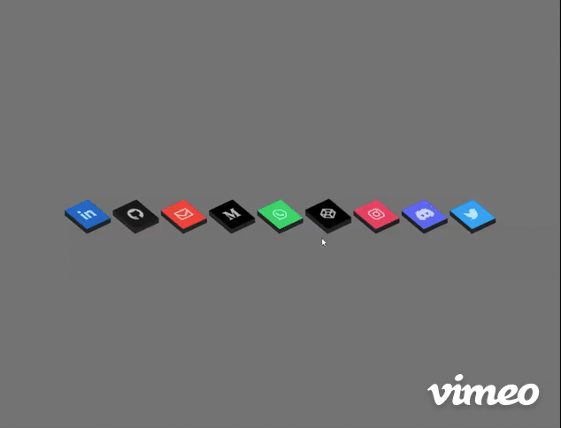</a>

**[Veja o funcionando](https://codepen.io/theslladev/full/NWYgoNy) | [Meu codigo](https://github.com/ThesllaDev/30DiasDeCSS-SASS/tree/main/Desafios/Dia%2001) | [Post LinkedIn](https://www.linkedin.com/posts/thalles-augusto_30diasdecss-html-css-activity-6956707177625448448-vLhH)**

---

##  Desafio dia 02 - Loaders animados 
<a href="https://codepen.io/theslladev/full/zYWdvaw" >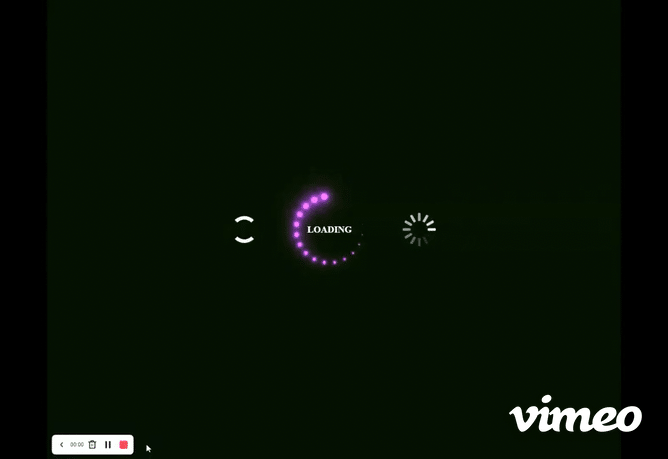</a>

**[Veja o funcionando](https://codepen.io/theslladev/full/zYWdvaw) | [Meu codigo](https://github.com/ThesllaDev/30DiasDeCSS-SASS/tree/main/Desafios/Dia%2002) | [Post LinkedIn](https://www.linkedin.com/posts/thalles-augusto_30diasdecss-html-css-activity-6957075872700862464-OZMs)**

---

##  Desafio dia 03 - Letreiro com mudança de cor de texto 

**[Veja o funcionando](https://codepen.io/theslladev/full/ZExJXoZ) | [Meu codigo](https://github.com/ThesllaDev/30DiasDeCSS-SASS/tree/main/Desafios/Dia%2003) | [Post LinkedIn](https://www.linkedin.com/posts/thalles-augusto_30diasdecss-html-css-activity-6957346363181293568-GXsP)**

---

##  Desafio dia 04 - Botões com efeito de borda, hover e click 
<a href="https://codepen.io/theslladev/full/MWVEaQw" >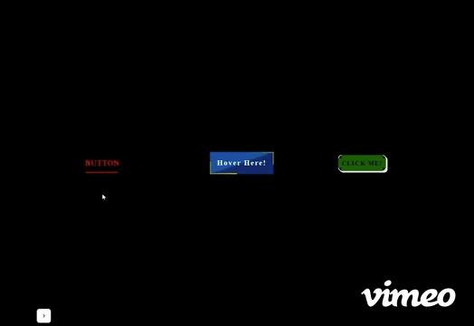</a>

**[Veja o funcionando](https://codepen.io/theslladev/full/MWVEaQw) | [Meu codigo](https://github.com/ThesllaDev/30DiasDeCSS-SASS/tree/main/Desafios/Dia%2004) | [Post LinkedIn](https://www.linkedin.com/posts/thalles-augusto_30diasdecss-html-css-activity-6957743039490453504-S_aJ)**

---

##  Desafio dia 05 - Joias do infinito com efeito de pulsar 

**[Veja o funcionando](https://codepen.io/theslladev/full/WNzZLob) | [Meu codigo](https://github.com/ThesllaDev/30DiasDeCSS-SASS/tree/main/Desafios/Dia%2005) | [Post LinkedIn](https://www.linkedin.com/posts/thalles-augusto_30diasdecss-html-css-activity-6958135089142620161-IXDJ)**

---

##  Desafio dia 06 - Efeito de animação do texto brilhando 

**[Veja o funcionando](https://codepen.io/theslladev/full/WNzXRmW) | [Meu codigo](https://github.com/ThesllaDev/30DiasDeCSS-SASS/tree/main/Desafios/Dia%2006) | [Post LinkedIn](https://www.linkedin.com/posts/thalles-augusto_30diasdecss-html-css-activity-6958489059958640640-AXZM)**

---

##  Desafio dia 07 - Preloader com efeito de ondulação 

**[Veja o funcionando](https://codepen.io/theslladev/full/VwXrRjj) | [Meu codigo](https://github.com/ThesllaDev/30DiasDeCSS-SASS/tree/main/Desafios/Dia%2007) | [Post LinkedIn](https://www.linkedin.com/posts/thalles-augusto_30diasdecss-html-css-activity-6958905224619024384-Rj4z)**

---

##  Desafio dia 08 - Radar animado 

**[Veja o funcionando](https://codepen.io/theslladev/full/VwXyevr) | [Meu codigo](https://github.com/ThesllaDev/30DiasDeCSS-SASS/tree/main/Desafios/Dia%2008) | [Post LinkedIn](https://www.linkedin.com/posts/thalles-augusto_30diasdecss-html-css-activity-6959195756800950272-vYXr)**

---

##  Desafio dia 09 - O pêndulo de Newton 
<a href="https://codepen.io/theslladev/full/yLKpvKz" >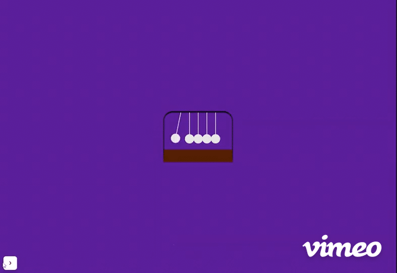</a>

**[Veja o funcionando](https://codepen.io/theslladev/full/yLKpvKz) | [Meu codigo](https://github.com/ThesllaDev/30DiasDeCSS-SASS/tree/main/Desafios/Dia%2009) | [Post LinkedIn](https://www.linkedin.com/posts/thalles-augusto_30diasdecss-html-css-activity-6959644132810088448-XbMW)**

---

##  Desafio dia 10 - Animação de troca de emojis 
<a href="https://codepen.io/theslladev/full/ZExvdLq" >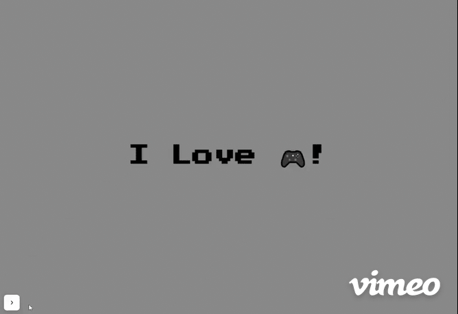</a>

**[Veja o funcionando](https://codepen.io/theslladev/full/ZExvdLq) | [Meu codigo](https://github.com/ThesllaDev/30DiasDeCSS-SASS/tree/main/Desafios/Dia%2010) | [Post LinkedIn](https://www.linkedin.com/posts/thalles-augusto_30diasdecss-html-css-activity-6959903974023925760-_zrL)**

---

##  Desafio dia 11 - Botões de ícone com efeito hover  
<a href="https://codepen.io/theslladev/full/LYdQQpd" >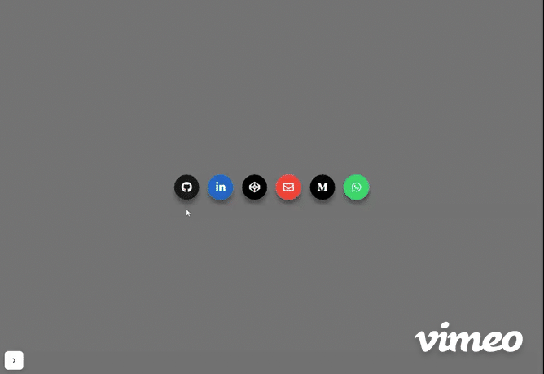</a>

**[Veja o funcionando](https://codepen.io/theslladev/full/LYdQQpd) | [Meu codigo](https://github.com/ThesllaDev/30DiasDeCSS-SASS/tree/main/Desafios/Dia%2011) | [Post LinkedIn](https://www.linkedin.com/posts/thalles-augusto_30diasdecss-html-html5-activity-6960270022845870080-4noz)**

---

##  Desafio dia 12 - Animação de preenchimento ao passar o mouse  
<a href="https://codepen.io/theslladev/full/vYRRLym" >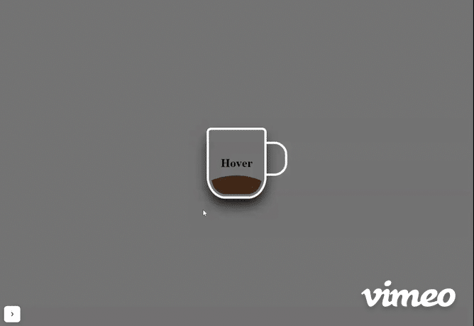</a>

**[Veja o funcionando](https://codepen.io/theslladev/full/vYRRLym) | [Meu codigo](https://github.com/ThesllaDev/30DiasDeCSS-SASS/tree/main/Desafios/Dia%2012) | [Post LinkedIn](https://www.linkedin.com/posts/thalles-augusto_30diasdecss-html-html5-activity-6960621683950956544-rLul)**

---

##  Desafio dia 13 - Placeholders loading  
<a href="https://codepen.io/theslladev/full/ExEEOdr" >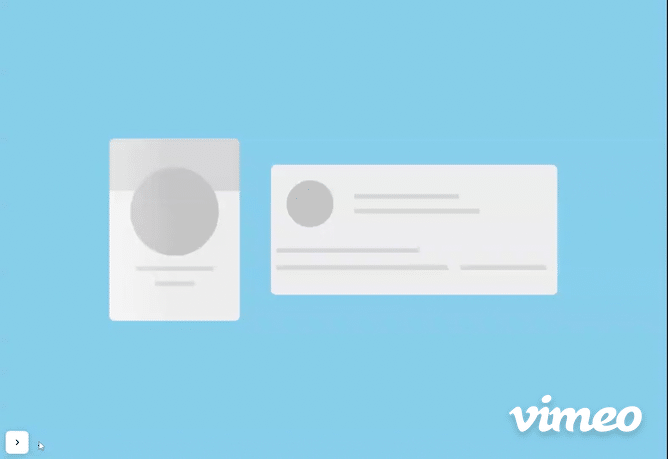</a>

**[Veja o funcionando](https://codepen.io/theslladev/full/ExEEOdr) | [Meu codigo](https://github.com/ThesllaDev/30DiasDeCSS-SASS/tree/main/Desafios/Dia%2013) | [Post LinkedIn](https://www.linkedin.com/posts/thalles-augusto_30diasdecss-html-html5-activity-6960989789688868864-Jeqd)**

---

##  Desafio dia 14 - Fundo de texto animado com efeito parallax 
<a href="https://codepen.io/theslladev/full/bGvMgdV" >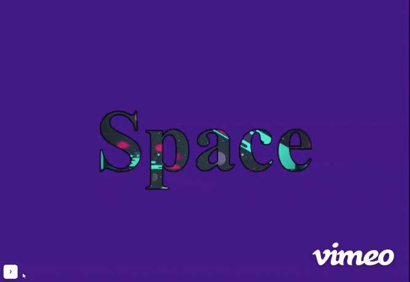</a>

**[Veja o funcionando](https://codepen.io/theslladev/full/bGvMgdV) | [Meu codigo](https://github.com/ThesllaDev/30DiasDeCSS-SASS/tree/main/Desafios/Dia%2014) | [Post LinkedIn](https://www.linkedin.com/posts/thalles-augusto_30diasdecss-html-html5-activity-6961329487904952320--fa-/)**

---

##  Desafio dia 15 - Animação de texto esfumaçado 
<a href="https://codepen.io/theslladev/full/OJvZBBq" >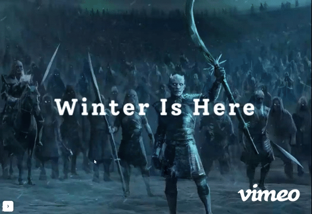</a>

**[Veja o funcionando](https://codepen.io/theslladev/full/OJvZBBq) | [Meu codigo](https://github.com/ThesllaDev/30DiasDeCSS-SASS/tree/main/Desafios/Dia%2015) | [Post LinkedIn](https://www.linkedin.com/posts/thalles-augusto_30diasdecss-html-html5-activity-6961739051137683456-zdSf)**

---

##  Desafio dia 16 - Botão com efeito de pressionamento de tecla 
<a href="https://codepen.io/theslladev/full/abYKzKo" >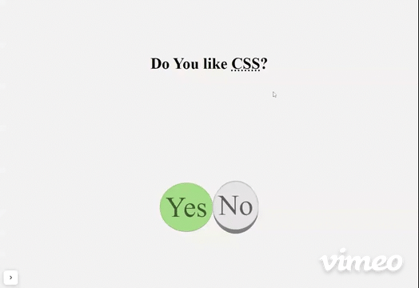</a>

**[Veja o funcionando](https://codepen.io/theslladev/full/abYKzKo) | [Meu codigo](https://github.com/ThesllaDev/30DiasDeCSS-SASS/tree/main/Desafios/Dia%2016) | [Post LinkedIn](https://www.linkedin.com/posts/thalles-augusto_30diasdecss-html-html5-activity-6962090231613263872-zVDt)**

---

##  Desafio dia 17 - Animação de bateria carregando 
<a href="https://codepen.io/theslladev/full/xxWzWPj" >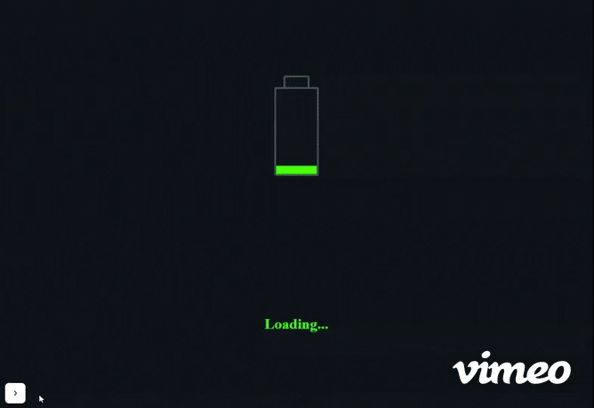</a>

**[Veja o funcionando](https://codepen.io/theslladev/full/xxWzWPj) | [Meu codigo](https://github.com/ThesllaDev/30DiasDeCSS-SASS/tree/main/Desafios/Dia%2017) | [Post LinkedIn](https://www.linkedin.com/posts/thalles-augusto_30diasdecss-html-html5-activity-6962455430623080449-EP5P)**

---

##  Desafio dia 18 - Texto flutuante e imersivo 

**[Veja o funcionando](https://codepen.io/theslladev/full/XWEBppM) | [Meu codigo](https://github.com/ThesllaDev/30DiasDeCSS-SASS/tree/main/Desafios/Dia%2018) | [Post LinkedIn](https://www.linkedin.com/posts/thalles-augusto_30diasdecss-html-html5-activity-6962880450407104512-s1BC?utm_source=linkedin_share&utm_medium=member_desktop_web)**

---

### 📝 Licença

Este projeto está sob a licença [MIT](./LICENSE).
